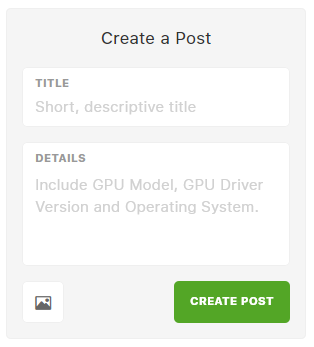
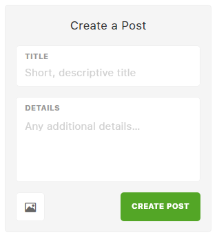

# Contributing

Thanks for being here and for being awesome! 👍

**Table of Contents**

- :mega: [Discussing](#discussing)
- :bug: [Reporting Bugs](#reporting-bugs)
- :sparkles: [Requesting Features](#requesting-features)
- :octocat: [Changing Code](#changing-code)

## Discussing

The easiest way to contribute to Salad is by participating in discussions on our [SaladChefs Discord server](https://discord.gg/7tmU8pj). The community often chimes in with helpful advice when you have a question, and you may also find yourself providing answers and helping others.

You can also participate in [bug reports](https://feedback.salad.io/bugs) and [feature requests](https://feedback.salad.io/features) on our dedicated feedback website. Some users find our feedback website easier to use than GitHub issues, and consolidating discussions about bugs and features helps us track and prioritize issues.

_Please don't use GitHub issues to ask a question._ We will politely close a GitHub issue that asks a question and kindly refer you to one of the aforementioned avenues.

## Reporting Bugs

We're sorry this happened to you!

First, search the [bug reports](https://feedback.salad.io/bugs) on our dedicated feedback website to see if this is already a known issue. If you find something that matches the bug you encountered, please upvote the existing bug report. If you have new or additional details, please comment on the existing bug report.

Second, consider jumping into the [#tech-support channel on the SaladChefs Discord server](https://discord.gg/7tmU8pj). The community may have already found a solution.

Finally, post a new [bug report](https://feedback.salad.io/bugs).



## Requesting Features

We love a good idea. Do you have one?

First, search the [feature requests](https://feedback.salad.io/features) on our dedicated feedback website to see if this is already a suggestion. If you find something that matches the idea you thought of first, please upvote the existing feature request. If you have new or additional details, please comment on the existing feature request.

Second, consider jumping into the [#feature-requests channel on the SaladChefs Discord server](https://discord.gg/7tmU8pj). The community may have some interesting insights.

Finally, post a new [feature request](https://feedback.salad.io/features).



## Changing Code

Interested in changing the world?

First, identify the scale of your proposed changes. If it is a small change, such as to fix grammar or spelling, feel free to start working on a fix. However, if it is a feature or substantial code contribution, please discuss it with the team first to ensure it fits in the product roadmap.

You can propose code changes by submitting GitHub pull requests. The code changes are expected to fit existing code styles and conventions. Using Visual Studio Code with the essentials extensions should minimize any manual work associated with code styles (see [Setting Up a Development Environment](#setting-up-a-development-dnvironment)).

Additionally, please consider taking a moment to read Miguel de Icaza's blog post titled [Open Source Contribution Etiquette](https://tirania.org/blog/archive/2010/Dec-31.html) and Ilya Grigorik's blog post titled [Don't "Push" Your Pull Requests](https://www.igvita.com/2011/12/19/dont-push-your-pull-requests/).

### Setting Up a Development Environment

First, install the latest, stable version of [Visual Studio Code](https://code.visualstudio.com/download) and the following essential extensions:

- [EditorConfig for VS Code](https://marketplace.visualstudio.com/items?itemName=EditorConfig.EditorConfig)
- [ESLint](https://marketplace.visualstudio.com/items?itemName=dbaeumer.vscode-eslint)
- [Prettier](https://marketplace.visualstudio.com/items?itemName=esbenp.prettier-vscode)

Next, install the latest, stable version of [nvm](https://github.com/nvm-sh/nvm) or [NVM for Windows](https://github.com/coreybutler/nvm-windows).

Next, install the required version of Node.js using nvm or NVM for Windows.

In a Bash terminal:

```bash
nvm install
nvm use
```

In a Windows Command Prompt terminal:

```cmd
set /p node_version= < .nvmrc
nvm install %node_version%
nvm use %node_version%
```

In a Windows PowerShell terminal:

```ps
$NodeVersion = Get-Content .nvmrc
& nvm install $NodeVersion
& nvm use $NodeVersion
```

Next, install the latest, stable version of [Yarn version 1](https://classic.yarnpkg.com/lang/en/) (version 2 doesn't work with Salad just yet).

Next, restore the project dependencies:

```sh
yarn install
```

Finally, open the project in Visual Studio Code. Use `Ctrl+Shift+P` to open the command palette. Choose the "Select TypeScript Version" command. Choose the "Use Workspace Version" option.
