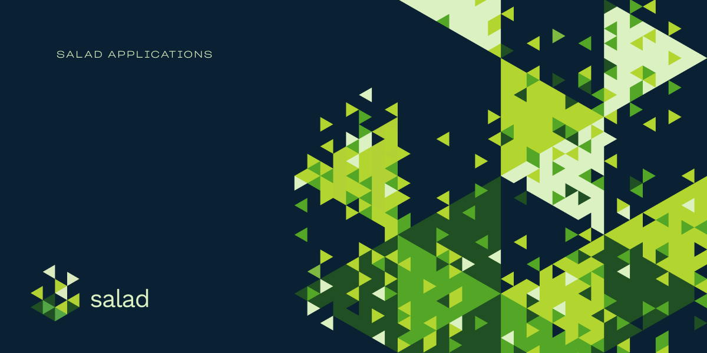

# Salad

     

## Intro

  

Salad allows gamers to mine crypto in their downtime. We turn your GPU power into credits you can spend on items like subscriptions, games, gift cards, and more from our curated storefront.

Our applications [mine cryptocurrency](https://www.salad.io/blog/a-gamers-guide-to-blockchain-and-crypto/) and the mining software is downloaded from our ["plugin" repository](https://github.com/SaladTechnologies/plugin-downloads/).

**Table of contents**

- 🚀 [Getting Started](#getting-started)
- 👥 [Community](#community)
- 👏 [Contributing](#contributing)
- 🐛 [Bug Bounty](#bug-bounty)

## Getting Started

Download and install the [latest release](https://github.com/SaladTechnologies/salad-applications/releases/latest), create an account and sign-in, and select the "Start" button to begin earning!

## Community

- Chatting on [Discord](https://discord.gg/7tmU8pj)
- Blogging at [Medium](https://medium.com/@saladchefs)
- Tweeting via [@saladtech](https://twitter.com/saladtech)
- Posting on [@salad.tech](https://www.instagram.com/salad.tech)

## Contributing

Check out our [contributing guide](./CONTRIBUTING.md) for more details.

## Bug Bounty

Salad is committed to building and protecting the world's most trusted way to monetize idle compute time. If you believe you have discovered a security vulnerability, we will gladly compensate you with some 💰💰💰 for responsibly disclosing the issue to us. Check out our [security policy](https://github.com/SaladTechnologies/salad-applications/security/policy) for more details.
